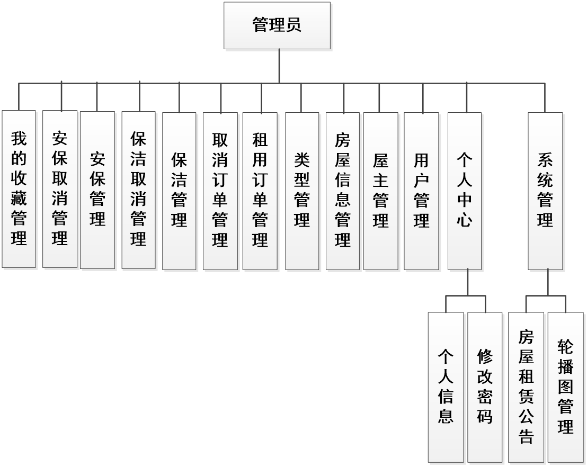
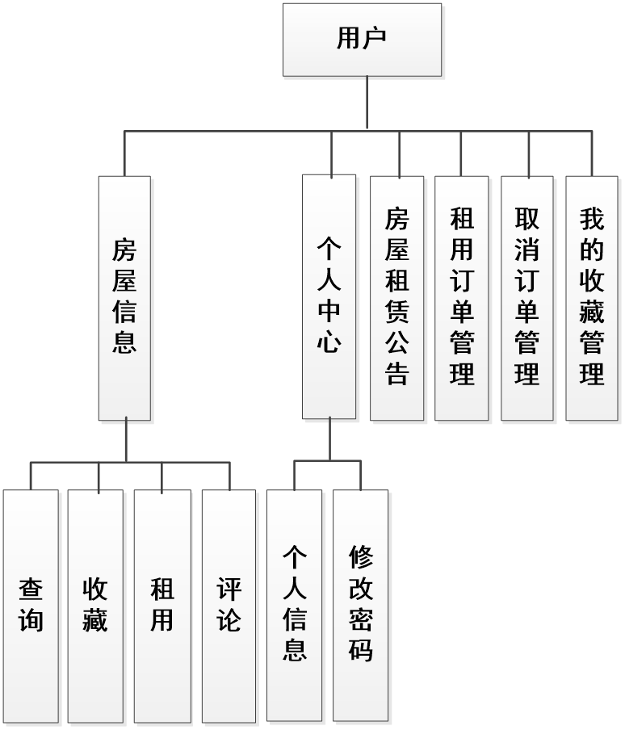
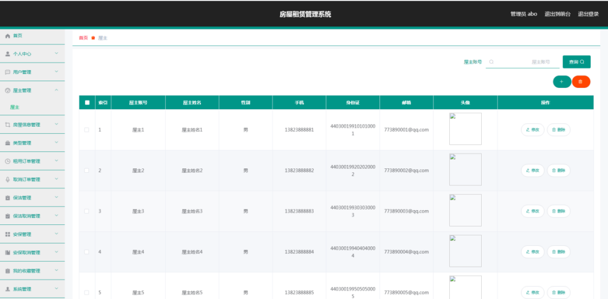
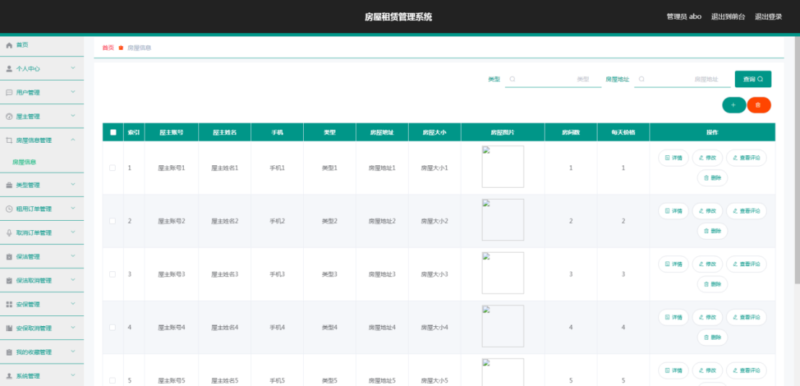
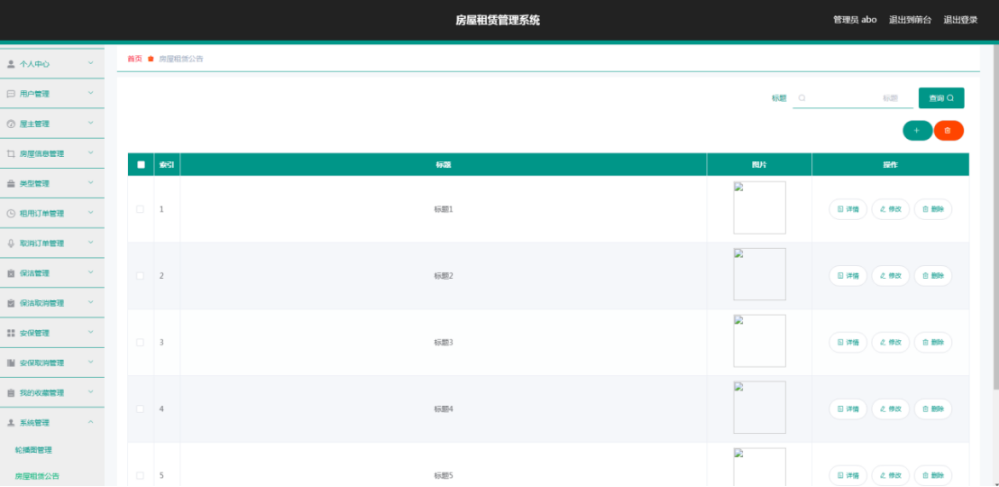
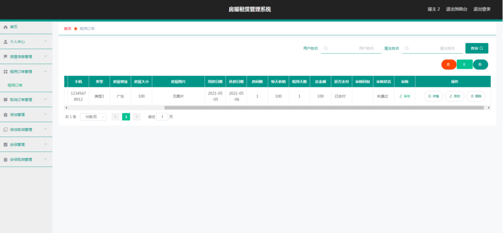
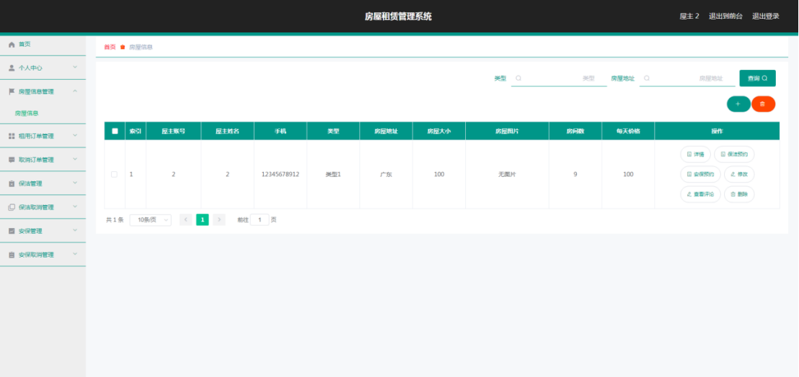
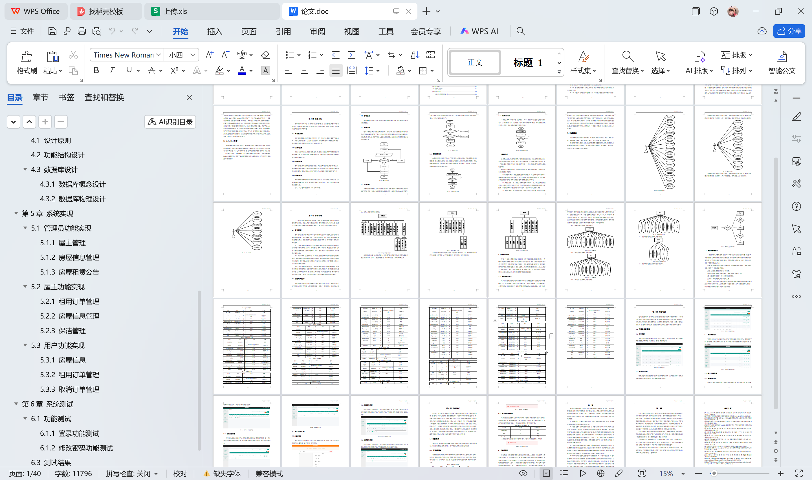

# springboot080-房屋租赁管理系统的设计与实现

>  博主介绍：
>  Hey，我是程序员Chaers，一个专注于计算机领域的程序员
>  十年大厂程序员全栈开发‍ 日常分享项目经验 解决技术难题与技术推荐 承接各类网站设计，小程序开发，毕设等。
>  【计算机专业课程设计，毕业设计项目，Java，微信小程序，安卓APP都可以做，不仅仅是计算机专业，其它专业都可以】

## 3000套系统可挑选，获取链接：https://chaerspol.github.io/

<b>QQ【获取完整源码】：674456564</b>

<b>QQ群【获取完整源码】：1058861570</b>

### 系统架构

> 前端：html | js | css | jquery | vue
>
> 后端：springboot | mybatis
> 
> 环境：jdk1.8+ | mysql | maven

# 一、内容包括
包括有  项目源码+项目论文+数据库源码+答辩ppt+远程调试成功

# 二、运行环境

> jdk版本：1.8 及以上； ide工具：IDEA； 数据库: mysql5.7及以上；编程语言: Java

# 三、需求分析

**3.1 可行性分析**

在正式对需要建设的项目进行投资前，有一个比较关键的步骤是不能缺少的，那就是可行性分析。它主要从当前技术，经济等角度去评估系统的可行性，在投资决策中常常采用这种科学的方法来论证项目。

**3.1.1 技术可行性**

当前，系统开发的技术已经发展成熟，而且通过计算机网络可以获取开发工具的使用方法，以及规范化编写的模块化代码，这些知识可以帮助开发者顺利完成本系统的编码工作。

**3.1.2 经济可行性**

本系统开发期间需要配置的软件环境，可以免费通过开发类官网下载安装，需要配置的硬件设备也不需要具备很高的性能，通常网吧电脑，或学校计算机机房的电脑都符合要求。因此，从经济方面考虑，房屋租赁管理系统开发可行。

**3.1.3 操作可行性**

房屋租赁管理系统根据用户使用习惯进行开发，设计的界面具有统一性，并具备优秀的导航功能。所以，只要会简单操作电脑的人员，可以无压力操作房屋租赁管理系统。
总之，从上述的论证来看，本系统可以开发。

**3.2 系统流程**

流程图这样的工具可以直观反映出系统内部的操作逻辑，可以帮助用户更好的理解系统。

# 四、功能模块

在前面分析的管理员功能的基础上，进行接下来的设计工作，最终展示设计的管理员结构图（见下图）。管理员管理屋主和用户，管理房屋，租房订单，保洁，安保，房屋租赁公告等信息

在前面分析的屋主功能的基础上，进行接下来的设计工作，最终展示设计的屋主结构图（见下图）。屋主管理房屋，审核租用订单，预约保洁和安保

在前面分析的用户功能的基础上，进行接下来的设计工作，最终展示设计的用户结构图（见下图）。用户收藏房屋，租用房屋，支付租房订单

# 五、效果图展示【部分效果图】

图5.1 屋主管理页面【管理员进入指定功能操作区之后可以管理屋主。其页面见下图。屋主的资料需要管理员负责管理，包括修改，新增，删除等操作】

图5.2 房屋信息管理页面【管理员进入指定功能操作区之后可以管理房屋信息。其页面见下图。管理员查看房屋对应的用户评论，可以增删改查房屋信息】

图5.3 房屋租赁公告页面【管理员进入指定功能操作区之后可以管理房屋租赁公告信息。其页面见下图。管理员发布房屋租赁公告信息，对本页面显示的房屋租赁公告进行修改，查询，删除】

图5.4 租用订单管理页面【屋主进入指定功能操作区之后可以管理租用订单。其页面见下图。屋主查看租用订单是否支付，审核用户租用房屋的订单】

图5.5 房屋信息管理页面【屋主进入指定功能操作区之后可以管理房屋信息。其页面见下图。屋主可以对自己的房屋预约保洁或安保。可以查看房屋对应的用户评论，可以修改房屋信息】

 <b>完整文章</b>
 
 
 

## 3000套系统可挑选，获取链接：https://chaerspol.github.io/

<b>QQ【获取完整源码】：674456564</b>

<b>QQ群【获取完整源码】：1058861570</b>

